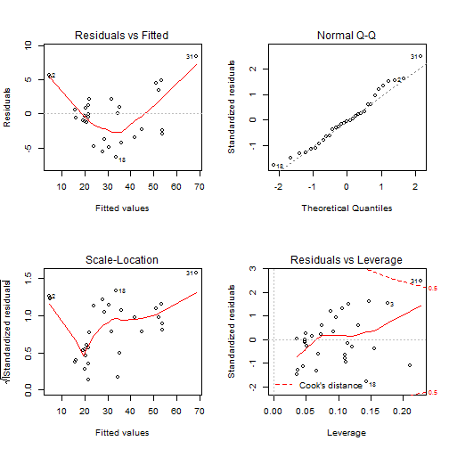

## Executive Summary


*In this app, I examine the trees dataset.*


*I check which model is optimal for predicting the volume of a tree, by using the predictors girth and height.*


*In the end I show the coefficients of the best model that were used in the previuos app (the shiny app) and creating plots of the best model*


--- 


## Analysis

```r
fit1 <- lm(Volume ~ Girth, data = trees)
fit2 <- lm(Volume ~ Girth+Height, data = trees)
ava <- anova(fit1,fit2)
#finding the best model, using anova test by checking the P-value
ava$`Pr(>F)`[2]
```

```
## [1] 0.01449097
```

```r
#extract coefficient of the best model
coef <- fit2$coefficients
coef
```

```
## (Intercept)       Girth      Height 
## -57.9876589   4.7081605   0.3392512
```


---


## Results


*According to the analysis, it is shown that the best model is the one that consists of both regressors (girth and heights). The coefficients that were found in the result, are the same as the ones that were used in the Shiny app.*


---


## Appendix
 
